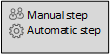
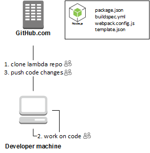
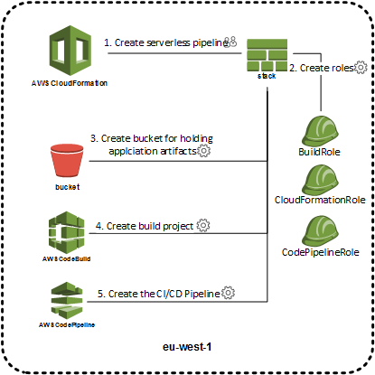
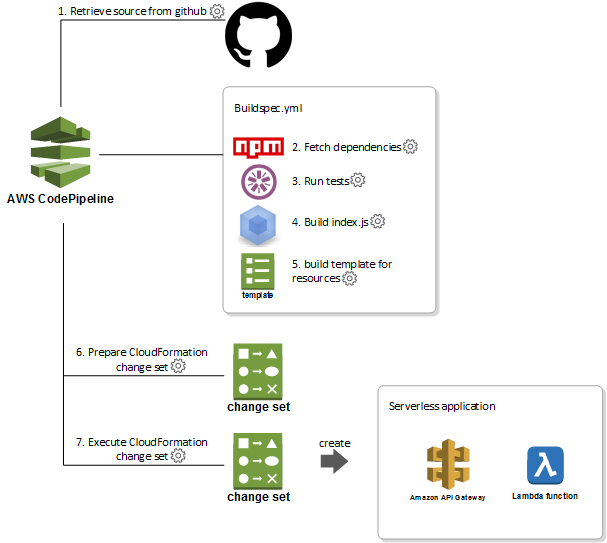

# Serverless application
Blueprint for creating a lambda function with CI/CD pipeline, based on node.js.

## Project setup
When creating a new serverless application this repository can be used as a template.

The node application will need the following specification/configuration files.

#### package.json  
Specifies project dependencies. Is used by the build pipeline to execute test and build.

#### webpack.config.js
Webpack is used to package the application into a single js file containing all project
dependencies. This includes external (packages located in `node_modules`) and local
dependencies (required functions that are part of the serverless application)  

The final application is located in the `build` directory after webpack have executed.

#### buildspec.yml
This is a aws specific build file used by AWS CodePipeline. The file is used by the
build action and specifies what happens in the different phases og a build. It is the
counterpart to the `Jenkinsfile`

#### template.json
This is the AWS CloudFormation template used to create the resources needed by the
application.

## Project pipeline

### Creating the pipeline
Setting up the project CI/CD pipeline is very easy. You just open the AWS CloudFormation
and create a new stack based on the `serverless-pipeline.json` file. The file needs
the following input from you to be able to create the pipeline. The pipeline will test, build
 and deploy the serverless application.

1. **AppName** - the name you want to give the new serverless application
2. **CodeBuildImage** - the language that the serverless application should use. `Default to nodejs v7.0.0`
3. **InputTemplate** - the name of input CloudFormation template for the application. `Default to template.json`
4. **OutputTemplate** - the name of the transformed template. This is the generated template used by the pipeline. `Default to output-template.yaml`
5. **GitHubUser** - the name of the user or organisation containing the repo. `Default to topdanmark`
6. **GitHubToken** - the Auth token with access to the repo.
7. **GitHubRepoName** - the name of the repository where the serverless application is located.
8. **GitHubRepoBranch** - the branch that the pipeline will build. `Default to master`

#### Serverless application resources
When the pipeline template is executing the following resources are created. Every 
serverless application will have it's own set of resources. This means that serverless
applications are completely independent, deleting one application and it's pipeline 
will not affect other serverless applications or pipelines.

When all resources and the pipeline have been created then the pipeline will automatically start.

### Running the pipeline
When the pipeline runs it will kick off another template that creates the resources
needed by the serverless application.

